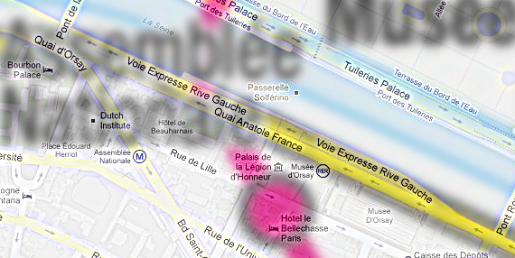
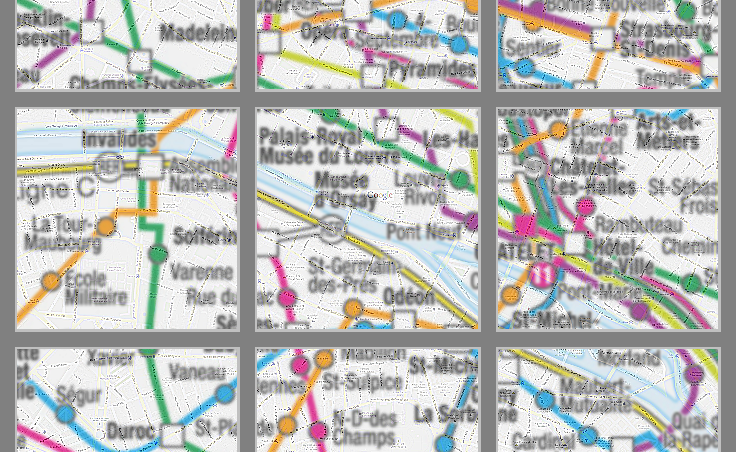
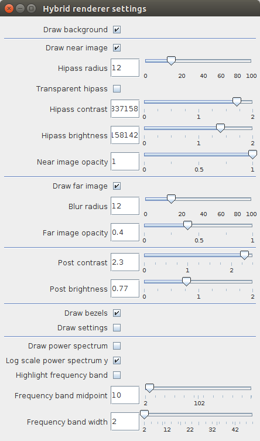

HybridVis - User Documentation. **Very Preliminary Version**

Pierre Dragicevic, Jean-Daniel Fekete, Petra Isenberg, Romain Primet.

# About HybridVis

HybridVis produces [hybrid images](http://www.aviz.fr/Research/HybridImageVisualizations) (NOTE:  https://hal.inria.fr/hal-00844878/PDF/HybridImageVisualization_CameraReady.pdf) for visualization on wall displays or other large, high-resolution surfaces (see also the dedicated [page](http://www.aviz.fr/Research/HybridImageVisualizations) on the Aviz website). These images are standard PNG files and may be viewed (or printed) with standard tools or software tailored for the display equipment (e.g. a mosaic viewer on a display wall). 

Near image attribution: [Google](https://www.google.com/permissions/geoguidelines.html)

Far image attribution: RATP

The above image is a close-up crop of a hybrid image. The *near image* (detailed street map) is clearly visible; names are legible and not obscured by the *far image* (metropolitan lines map). Conversely, the high-pass processing applied to the street-level map ensures that the *far image* is legible when seen from a distance.

Simulation of a hybrid image viewed from a 4.3 meter distance. The *far image* is legible and not "scrambled" by the *near image*.

# Running 

HybridVis requires the Java Runtime Environment 1.7+.

Unzip the archive in the directory of your choice.

No other installation step is required. 

## Linux

Run hybridvis.sh (after making it executable if needed) from the distribution directory, or double-click the hybridvis-with-dependencies.jar file.

## Windows

Double-click the hybridvis-with-dependencies.jar file.

## OSX

**_Note_***: On OS X, we have had issues with Java 1.7. We recommend that you use java 1.8.*

Double-click the hybridvis-with-dependencies file.

Make sure that your system allows running unsigned apps (the current build is unsigned). To allow unsigned apps, see [this page](https://support.apple.com/en-us/HT202491).

Alternatively, open a terminal, go to the project directory and type java -jar hybridvis-with-dependencies.jar 

# Loading an existing project

We recommend that you start learning the tool by loading an example project. If you would like to start with the example project open example-project/project.properties. If you’d like from a project you created (see further below) - in the project folder open the .properties file that belongs to your project.

The user interface shows how the map example appears on a wall display, depending on the observer's distance to the wall display.

## Interactions

The image viewer will display both images you loaded and superimpose them using the hybrid image algorithm. You can inspect your first result using the following interactions:

**left-click** on any area on the image: this will zoom into the image to a resolution matching your screen . The slider on the top changes to show you the simulated viewing distance.

**right-click** on the image: zoom back out to see a rendering from afar. The distance slider changes to show you the simulated viewing distance.

**moving the "Viewer distance slider"**: this adjusts the simulated viewing distance. The image will re-render once you release the slider. Wait a moment for the filters to be re-applied if your images are very large. 

## Tweak settings

## Rendering a hybrid image

To start a rendering, choose Generate/Generate composite image.

If a project path has been set (i.e. a project has been opened or saved), hybrid images are generated in the wall-images folder within the project root (if it exists). Otherwise, the software will prompt for an output path.

*Note: rendering may take a long time for wall-sized images.*

# Creating a new project for my wall display: step-by-step guide

## Set wall display

The display is set through the Project/Set wall display menu. Examples are provided in the displays folder of the software distribution.

## Prepare images

To properly generate hybrid images, you will usually need near and far images rendered *at the native resolution of your display wall* (or your printed surface).

However, since far images typically have a low spatial resolution, it is possible to use a lower-resolution far image if its aspect ratio matches that of the near image.

## Create a new project

## Saving and loading Projects

You may save the settings for your visualization as a project file. Choose File/Save and set the file name (for now, the suggested extension is .properties).

To load a project, choose File/Open and select a project file.

## Set near and far images

A hybrid image visualization superimposes a near image (to which a high-pass filter is applied) and a far image (to which a low-pass filter is applied).

Near and far images are set through the Project/Set near image menu (resp. Project/Set far image).

Near and far images should have the same aspect ratio.

## Tweak hybrid image settings

like before.

## Export and test on the wall display

export bitmap like before.

## Project structure

File paths are interpreted relative to the project directory (to make it easier to move projects around). Here is a suggested project structure:

project/

├── project.properties

├── wall-images

├── images

│   ├── near.png

│   └── far.png

└── displays

    └── my-wall-display.properties

Ensure that all resources (images and display file) are located under the project root (i.e. copy example images and display files if needed).

# Creating a new project using Java

If the near and far images are rendered dynamically instead of being loaded as bitmap images, it's easier to test different visualization designs and to run the same code on different wall displays. For this, you can extend the class (...). We don't provide much documentation but you can look at examples in (...).

# Creating a new display configuration

Since display walls come in different arrangements, you may need a display configuration to tailor generated images to your particular needs.

Display configuration files are simple property lists. Displays are rectangular arrangements of tiles (where a tile is typically a monitor).

The following properties should be defined:

**xResolution**: horizontal display resolution, in pixel, for one screen tile

**yResolution**: vertical display resolution, in pixel, for one screen tile

**xTiles**: number of horizontal tiles

**yTiles**: number of vertical tiles

**pixelWidth**: pixel width in meters (for instance an Apple 30-inch cinema dispay has a pixel width of 0.00025m)

**pixelHeight**: pixel height in meters (for instance an Apple 30-inch cinema dispay has a pixel height of 0.00025m)

On most displays, pixels are square to a good approximation.

As of feb. 2016, there is no support for adjusting bezel widths. Bezels are simply ignored during rendering. This is mitigated by the fact that the vast majority wall displays have a way of "drawing under the bezels", and the physical screen size may be set to include bezel widths in the display configuration.

